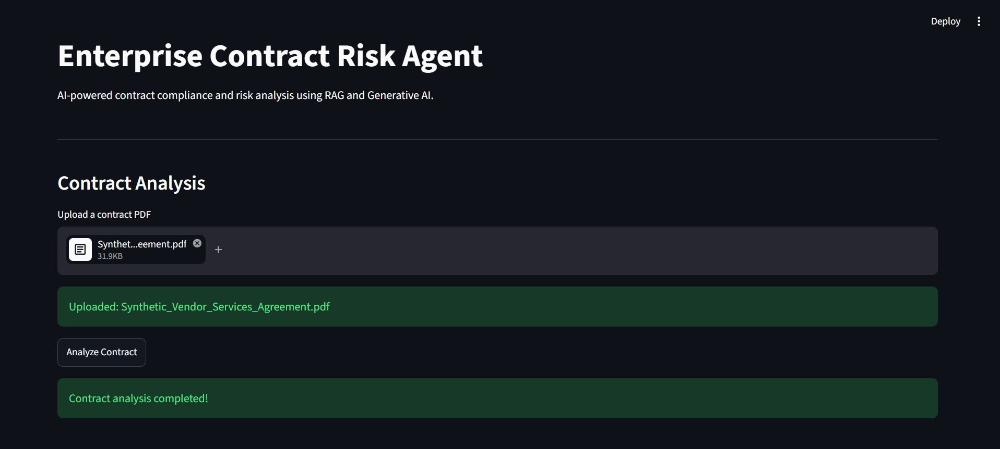
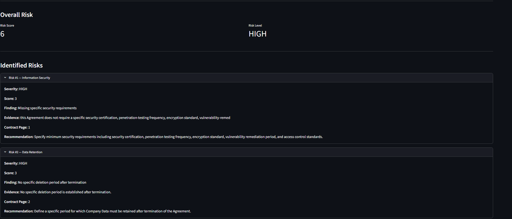
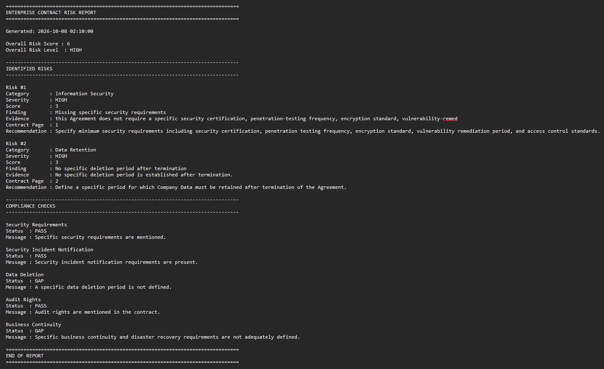

# AI Contract Risk Analyzer

An AI-powered contract analysis application that uses **Retrieval-Augmented Generation (RAG), semantic search, and a local Large Language Model (LLM)** to identify potential contractual compliance and operational risks.

The application analyzes contract documents and produces **structured risk findings, supporting evidence, contract page references, severity levels, recommendations, compliance checks, and an overall risk score.**

> **Note:** The contract included in this repository is fully synthetic and contains intentionally introduced risk scenarios for testing and evaluation. No confidential company or client information is used.

---

## 🎯 Why I Built This

I built this project to gain practical hands-on experience with **Generative AI, RAG pipelines, semantic search, LLM integration, and AI-based risk analysis**, while connecting these technologies with my previous experience in **Risk & Compliance, Python, SQL, and automation**.

The goal was to build a practical AI application rather than a simple chatbot.

The system focuses on a realistic use case:

> **Can an AI system analyze a contract, retrieve relevant evidence, identify potential contractual risks, and generate an explainable risk report?**

---

## 💡 What the Application Does

A user provides a contract PDF.

The system then:

1. Extracts text while preserving page numbers.
2. Splits the document into overlapping chunks.
3. Converts each chunk into an embedding vector.
4. Stores the processed content in a local knowledge base.
5. Converts the user's analysis request into an embedding.
6. Retrieves the most relevant contract sections using semantic similarity.
7. Sends the retrieved evidence to the local Qwen3 LLM.
8. Extracts structured contractual risk findings.
9. Normalizes risk categories.
10. Assigns severity and numerical risk scores.
11. Runs deterministic compliance checks.
12. Generates a structured contract risk report.

---

# 🏗️ Architecture

```text
                         ┌─────────────────────┐
                         │     Contract PDF    │
                         └──────────┬──────────┘
                                    │
                                    ▼
                         ┌─────────────────────┐
                         │ Document Extraction │
                         │      + Pages        │
                         └──────────┬──────────┘
                                    │
                                    ▼
                         ┌─────────────────────┐
                         │   Text Chunking     │
                         │   + Overlap         │
                         └──────────┬──────────┘
                                    │
                                    ▼
                         ┌─────────────────────┐
                         │ Sentence Transformer│
                         │    Embeddings       │
                         └──────────┬──────────┘
                                    │
                                    ▼
                         ┌─────────────────────┐
                         │ Local Knowledge Base│
                         └──────────┬──────────┘
                                    │
                            User Analysis Query
                                    │
                                    ▼
                         ┌─────────────────────┐
                         │   Semantic Search   │
                         │ Cosine Similarity   │
                         └──────────┬──────────┘
                                    │
                                    ▼
                         ┌─────────────────────┐
                         │     RAG Context     │
                         └──────────┬──────────┘
                                    │
                                    ▼
                         ┌─────────────────────┐
                         │      Qwen3 4B       │
                         │   Local LLM/Ollama  │
                         └──────────┬──────────┘
                                    │
                                    ▼
                         ┌─────────────────────┐
                         │ Structured Risk JSON│
                         └──────────┬──────────┘
                                    │
                         ┌──────────┴──────────┐
                         ▼                     ▼
                ┌──────────────────┐  ┌──────────────────┐
                │ Category         │  │ Compliance       │
                │ Normalization    │  │ Checks           │
                └────────┬─────────┘  └────────┬─────────┘
                         │                     │
                         └──────────┬──────────┘
                                    ▼
                         ┌─────────────────────┐
                         │    Risk Scoring     │
                         └──────────┬──────────┘
                                    │
                                    ▼
                         ┌─────────────────────┐
                         │ Contract Risk Report│
                         └─────────────────────┘
```

---

# 🔎 RAG Pipeline

The core of the project is a simple Retrieval-Augmented Generation pipeline.

### 1. Document Ingestion

The PDF is processed using `pypdf`.

The application preserves the **page number and extracted text** instead of treating the document as one large text block.

Example:

```text
Page: 1
Text: Vendor must notify the Company of a security incident...
```

### 2. Chunking

The extracted content is divided into overlapping chunks.

Current configuration:

```text
Chunk size:     500 characters
Overlap:        100 characters
```

The overlap helps preserve context between neighboring chunks.

### 3. Embeddings

Each chunk is converted into a numerical vector using:

```text
all-MiniLM-L6-v2
```

The model generates **384-dimensional embeddings** for the document chunks.

### 4. Semantic Search

When an analysis request is submitted, the query is also converted into an embedding.

The system calculates **cosine similarity** between the query vector and document chunk vectors.

The highest-scoring chunks are retrieved as evidence.

### 5. Retrieval-Augmented Generation

The retrieved contract evidence is provided to Qwen3 through a controlled prompt.

The LLM is instructed to:

- Use only the supplied contract evidence
- Avoid inventing information
- Return structured JSON
- Include supporting evidence
- Include the contract page
- Identify contractual gaps rather than making unsupported legal claims

This allows the LLM to reason over relevant contract content without requiring the entire document to be placed into the prompt.

---

# 🤖 Risk Analysis

The LLM returns structured risk information in JSON format.

Example:

```json
{
  "category": "Information Security",
  "severity": "HIGH",
  "finding": "Contractual security requirement is not sufficiently defined.",
  "evidence": "Supporting contract evidence...",
  "page": 1,
  "recommendation": "Define specific security obligations in the agreement."
}
```

The application then processes the result through additional deterministic components.

### Risk Categories

Examples include:

- Information Security
- Data Retention
- Business Continuity
- Other contractual risk categories

### Severity

Each identified risk receives:

```text
HIGH   → 3 points
MEDIUM → 2 points
LOW    → 1 point
```

The individual scores are combined into an overall risk score.

---

# ✅ Deterministic Compliance Checks

The project does not rely entirely on the LLM.

It also contains deterministic checks for selected contractual requirements, including:

- Security requirements
- Security incident notification
- Data deletion
- Audit rights
- Business continuity

Example:

```text
Security Requirements
Status: PASS

Security Incident Notification
Status: PASS

Data Deletion
Status: GAP

Audit Rights
Status: PASS

Business Continuity
Status: GAP
```

This creates a simple **hybrid approach**:

```text
LLM-based analysis
        +
Deterministic checks
        ↓
Structured risk assessment
```

---

# 🛡️ Hallucination Control

A key design goal of the project is to reduce unsupported LLM-generated findings.

The risk-analysis prompt explicitly instructs the model to:

- Use only retrieved contract evidence
- Not introduce outside information
- Not invent contractual requirements
- Not claim legal non-compliance without evidence
- Return no risks when the evidence does not support a finding

### Unsupported Question Test

The application was tested with:

> Does the contract specify that the vendor has GDPR compliance certification?

The synthetic contract does not contain such a requirement.

The agent therefore returned:

```text
Risks extracted by LLM: 0

Overall Risk Score: 0
Overall Risk Level: LOW

No supported risks identified.
```

This test is intended to verify that the application does not automatically generate a risk simply because a compliance-related term appears in the user's question.

---

# 🧪 Evaluation

The project includes a focused evaluation test set covering three contractual risk categories:

| Test Case | Expected Category | Result |
|---|---|---|
| Information Security | Information Security | ✅ PASS |
| Data Retention | Data Retention | ✅ PASS |
| Business Continuity | Business Continuity | ✅ PASS |

### Evaluation Result

```text
Tests Passed: 3 / 3
Evaluation Accuracy: 100%
```

> **Important:** The 100% result represents performance on the three included evaluation cases only. It should not be interpreted as general model accuracy or production-level accuracy.

The project also includes a separate unsupported-question/hallucination test.

---

# 🖥️ Application Interface

The project includes a Streamlit interface that allows a user to:

- Upload a contract PDF
- Run contract analysis
- View identified risks
- View severity and risk scores
- View supporting evidence
- View contract page references
- View compliance checks
- Download the generated report

The same analysis pipeline can also be executed from the command line.

---

# 📸 Screenshots

## 1. Application Overview

The Streamlit application provides a simple interface for uploading a contract and starting the analysis.



---

## 2. Risk Analysis Results

The application displays the overall risk score, risk level, identified risk categories, and compliance findings.



---

## 3. Generated Risk Report

The system generates a structured report containing risk findings, evidence, severity, recommendations, and compliance checks.



---

## 4. Project Architecture

High-level workflow showing how the document moves through extraction, chunking, embeddings, semantic retrieval, RAG, risk analysis, and report generation.


> **Note:** Screenshots are from the local Streamlit application and use a synthetic contract created specifically for testing.

---


---

# 🛠️ Technology Stack

| Technology | Purpose |
|---|---|
| **Python** | Application development |
| **PyPDF** | PDF text extraction |
| **Sentence Transformers** | Text embeddings |
| **all-MiniLM-L6-v2** | Local embedding model |
| **NumPy** | Vector similarity calculations |
| **Ollama** | Local LLM runtime |
| **Qwen3 4B** | Local language model |
| **Streamlit** | Web interface |
| **JSON** | Knowledge base and structured output |
| **Git/GitHub** | Version control |

---

# 📂 Project Structure

```text
Enterprise-AI-Compliance-Agent/
│
├── app/
│   ├── document_loader.py
│   ├── chunker.py
│   ├── embeddings.py
│   ├── search.py
│   ├── build_knowledge_base.py
│   ├── llm.py
│   ├── rag.py
│   ├── category_normalizer.py
│   ├── risk_scoring.py
│   ├── compliance_checker.py
│   ├── report_generator.py
│   ├── risk_agent.py
│   ├── evaluation.py
│   ├── hallucination_test.py
│   ├── logger.py
│   └── streamlit_app.py
│
├── data/
│   ├── documents/
│   └── processed/
│
├── screenshots/
│   ├── 01-app-overview.png
│   ├── 02-risk-analysis.png
│   ├── 03-generated-report.png
│   └── 04-architecture.png
│
├── requirements.txt
└── README.md
```

# ⚠️ Current Limitations

This is intentionally a **basic portfolio prototype**, not a production enterprise platform.

Current limitations include:

- Text-based PDF processing
- Fixed-size chunking
- Small local LLM
- Local JSON knowledge base
- Small evaluation dataset
- Limited compliance rules
- No authentication or role-based access
- No production database or vector database
- No OCR pipeline for scanned documents
- Human review is still required for final decisions

---

# 🔮 Possible Future Improvements

If this prototype were extended further, possible improvements could include:

- Clause-aware document chunking
- OCR for scanned contracts
- Production vector database
- Larger and more diverse evaluation datasets
- Stronger LLM infrastructure
- Automated schema validation
- Authentication and role-based access
- Audit logging and monitoring
- Human-in-the-loop review workflow
- Support for multiple contract formats

---

# 👨‍💻 Author

**Aditya Bhagwat**

B.Tech Artificial Intelligence | Risk & Compliance | Python | SQL | Generative AI

GitHub:  
https://github.com/bhagwataditya28
